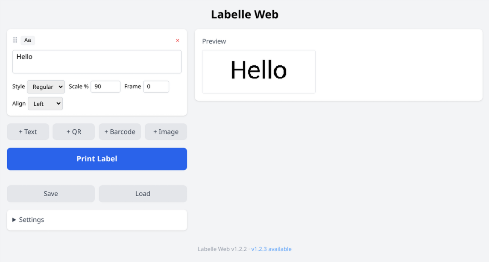

# Labelle Web

A web interface for [labelle](https://github.com/labelle-org/labelle) DYMO label printers. Compose labels with text, QR codes, barcodes, and images in your browser, with a live server-side preview and one-click printing.

Built as a modern replacement for the original PyQt6 desktop GUI, designed to run on a headless server (e.g. Raspberry Pi) and be accessed from any device on the network.



## Background Story

I have an older Dymo LabelManager that works perfectly, but it's tethered via USB. I almost bought a new "smart" WiFi label maker, but I really didn't like the proprietary apps or the idea of buying new hardware when my old one still worked fine.

I found the awesome [Labelle](https://github.com/labelle-org/labelle) project (an open-source tool for Dymo printers) and decided to build a lightweight Web UI wrapper around it. Now I have it running on a Raspberry Pi in my closet. I can pull up the interface on my phone, type a label (or upload an image), and print instantly without needing to plug in my laptop.

This is a vibe-coded project - but I've been a software engineer for most of the last 20 years, so I sometimes know what I'm doing. Using AI tools over just the past few weeks, I solved a lot of genuine tensions I've had. Tensions where I had ideas for solutions but not enough time to actually sit down and implement them. With AI tools I write my ideas, carefully review the results, and give new instructions. I'm enjoying solving these long-standing tensions in mere hours!

You can fight against AI usage or learn to embrace it as a new way of working. It's a similar - but bigger - shift to when we switched from simple text editors to IDEs. Go and enjoy this revolution of sorts, have fun!

## Features

- **Text widgets** -- multiline text with font style (regular/bold/italic/narrow), scale, frame border, and alignment
- **QR code widgets** -- encode any text or URL
- **Barcode widgets** -- CODE128, CODE39, EAN13, EAN8, UPC, ITF, and more, with optional human-readable text
- **Image widgets** -- upload any image; automatically resized and converted to monochrome for the label
- **Pixel-perfect preview** -- live server-side rendering via labelle's own render engines, so what you see is exactly what prints
- **Label settings** -- tape size, margins, minimum length, justify, foreground/background colors
- **Per-widget font styles** -- each text widget can have its own font style, scale, frame, and alignment
- **Multi-printer support** -- automatically detects all connected DYMO printers; select specific printer when multiple are available
- **Virtual printers** -- configure virtual printers that save labels as PNG files (great for testing, archiving, and development)
- **Save/load labels** -- export label designs to JSON files and load them back, with embedded image data for portability
- **Print via labelle** -- sends labels to the printer using the labelle Python library over USB

## Prerequisites

- **Docker** (recommended) or **Node.js** >= 18 (for client build) + **Python** >= 3.10 with **labelle** installed
- A supported DYMO label printer connected via USB (for printing)

## Quick Start (Docker)

The easiest way to run Labelle Web, and the recommended approach for [Komodo](https://komo.do/) or any Docker-based deployment.

```bash
docker compose up -d
```

The app will be available at `http://<host>:5000`.

Pre-built images for **amd64** and **arm64** (Raspberry Pi) are published to `ghcr.io/szrudi/labelle-web`. The `compose.yaml` pulls the latest image by default; if you'd rather build locally, run `docker compose up -d --build`.

The container includes Python and the labelle library -- no host-level Python installation needed. USB passthrough is configured in `compose.yaml` so the container can talk to your DYMO printer.

### Komodo

To deploy with Komodo, point a **Stack** at this repository. Komodo will pick up the `compose.yaml` automatically. Make sure the host machine has the DYMO printer connected via USB.

### Building the image manually

```bash
docker build -t labelle-web .
docker run -d -p 5000:5000 --privileged -v /dev/bus/usb:/dev/bus/usb labelle-web
```

## Quick Start (bare metal)

If you prefer to run without Docker, you need Node.js >= 18 (for building the client) and Python >= 3.10.

```bash
# Create a Python virtual environment and install labelle
python3 -m venv .venv
.venv/bin/pip install --no-deps labelle

# Install all dependencies (Node.js + Python)
npm run install:all

# Optional: configure environment (virtual printers, port, etc.)
cp .env.example .env
# Edit .env to your needs

# Development (Vite dev server + Flask with hot reload)
npm run dev

# Production build
npm run build

# Start production server
npm start

# Run tests
npm test
```

In development, the Vite dev server runs on `http://localhost:5173` and proxies API requests to the Flask backend on the configured `PORT`.

In production, Flask serves both the API and the built client on the configured `PORT` (default 5000).

> **Note:** If you previously ran with Docker, the virtual printer output directories may be owned by root. Fix with: `sudo chown -R $USER output/`

### Running as a systemd service

Ideal for a dedicated Raspberry Pi — starts automatically on boot, restarts on failure.

First, complete the bare metal setup above (venv, dependencies, `npm run build`). Then install the service:

```bash
# Edit the service file if your install path differs from /opt/labelle-web
sudo cp labelle-web.service /etc/systemd/system/
sudo systemctl daemon-reload
sudo systemctl enable labelle-web
sudo systemctl start labelle-web
```

Check status and logs:

```bash
sudo systemctl status labelle-web
journalctl -u labelle-web -f
```

> **Note:** The user running the service needs USB access to the printer. Either add them to the `plugdev` group (`sudo usermod -aG plugdev $USER`) or use the `--privileged` approach from the Docker section.

## Project Structure

```
labelle-web/
  client/                   # Vite + React + TypeScript frontend
    src/
      components/           # React UI components
      lib/                  # API client, constants
      state/                # Zustand store
      types/                # TypeScript type definitions
  server/                   # Python/Flask backend
    app.py                  # Flask application with routes and static serving
    label_builder.py        # Converts widget JSON to labelle render engines
    config.py               # Environment-based configuration (virtual printers)
    virtual_printer.py      # Virtual printer implementation (saves PNGs to disk)
    requirements.txt        # Python dependencies
    tests/                  # Backend tests (pytest)
```

See [ARCHITECTURE.md](docs/ARCHITECTURE.md) for detailed design documentation.

## Configuration

| Environment Variable | Default    | Description                          |
|---------------------|------------|--------------------------------------|
| `PORT`              | `5000`     | Server listen port                   |
| `VIRTUAL_PRINTERS`    | (none)     | JSON array of virtual printers (see below) |

### Testing with Virtual Printers

Virtual printers allow you to test the multi-printer UI without needing multiple physical printers. They save labels as PNG files to configured directories instead of physically printing.

**Use cases:**
- Test multi-printer functionality with a single physical printer
- Archive label output for documentation
- Development without printer hardware
- CI/CD testing

**Configuration:**

Set the `VIRTUAL_PRINTERS` environment variable to a JSON array of printer configurations:

```bash
export VIRTUAL_PRINTERS='[{"name":"Office Printer","path":"./output/office"},{"name":"Warehouse Printer","path":"./output/warehouse"}]'
```

Each printer configuration requires:
- `name`: Display name (will appear as "{name} (Virtual)" in UI)
- `path`: Directory where labels will be saved (created automatically)

**Docker setup:**

Configure virtual printers in your `.env` file (see `.env.example` for examples). The `compose.yaml` loads it automatically via `env_file`. To access saved labels on the host, uncomment the output volume mount in `compose.yaml`:

```yaml
volumes:
  - ./output:/app/output
```

**Output format:** Labels are saved as `label_YYYYMMDD_HHMMSS_uuid.png` in the configured directory.

## API Endpoints

### `POST /api/print`

Print a label to the connected DYMO printer.

**Request body:**
```json
{
  "widgets": [
    { "type": "text", "text": "Hello\nWorld", "fontStyle": "bold", "fontScale": 90, "frameWidthPx": 0, "align": "center" },
    { "type": "qr", "content": "https://example.com" },
    { "type": "barcode", "content": "12345", "barcodeType": "code128", "showText": true },
    { "type": "image", "filename": "uploaded-uuid.png" }
  ],
  "settings": {
    "tapeSizeMm": 12,
    "marginPx": 56,
    "minLengthMm": 0,
    "justify": "center"
  }
}
```

**Response:** `{ "status": "success", "message": "Label sent to printer." }`

### `POST /api/preview`

Generate a server-side PNG preview using labelle's render engines.

Same request body as `/api/print`. Returns `image/png`.

### `POST /api/upload-image`

Upload an image for use in image widgets. Accepts `multipart/form-data` with a `file` field.

**Response:** `{ "filename": "uuid.png" }`

The returned filename is used in the `image` widget's `filename` field for subsequent print/preview requests.

## License

This project wraps the [labelle](https://github.com/labelle-org/labelle) CLI. Labelle is not affiliated with DYMO. See labelle's license and disclaimers for details.
